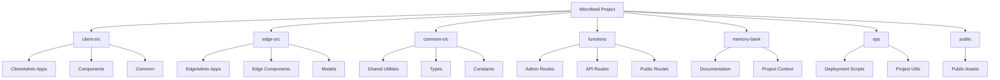

# Microfeed Project File Index

Generated on: 2025-03-07 12:02:14

This index provides a structured view of the microfeed project source code.

## Project Structure Overview

Microfeed is a Cloudflare-based feed management system built using edge computing (Cloudflare Workers) and a SQLite-compatible database (D1). The project allows users to create and manage RSS and JSON feeds with a modern, web-based admin interface.

### System Architecture

The application follows a hybrid architecture pattern where server-side rendering happens at the edge (via Cloudflare Workers) and client-side interactivity is enabled through React components.

```mermaid
graph TB
    %% Main components
    Client[Client Browser]
    CFWorkers[Cloudflare Workers]
    D1DB[(Cloudflare D1 Database)]
    R2Storage[(Cloudflare R2 Storage)]
    
    %% Application layers
    subgraph "Backend Services"
        EdgeFunctions[Edge Functions]
        Models[Database Models]
        FeedBuilders[Feed Builders]
        Theme[Theme Rendering]
    end
    
    subgraph "Frontend Apps"
        AdminChannel[Channel Management]
        AdminItems[Items Management]
        AdminSettings[Settings Management]
        AdminHome[Dashboard]
        CustomCode[Custom Code Editor]
    end
    
    %% Connections
    Client -->|HTTP Requests| CFWorkers
    CFWorkers -->|Processes Requests| EdgeFunctions
    EdgeFunctions -->|Data Access| Models
    Models -->|CRUD Operations| D1DB
    EdgeFunctions -->|Media Storage| R2Storage
    Models -->|Generate Feeds| FeedBuilders
    FeedBuilders -->|Format Output| Theme
    Theme -->|Render Pages| CFWorkers
    CFWorkers -->|Serve Content| Client
    
    EdgeFunctions -->|Mount Client Apps| Frontend Apps
    Frontend Apps -->|API Calls| EdgeFunctions
    
    %% Feed Access
    Client -->|RSS/JSON Feed| CFWorkers
    
    %% Styling
    classDef cloud fill:#f9f9ff,stroke:#9999ff,stroke-width:2px;
    classDef component fill:#f9fff9,stroke:#99ff99,stroke-width:2px;
    classDef data fill:#fff9f9,stroke:#ff9999,stroke-width:2px;
    
    class CFWorkers,R2Storage,D1DB cloud;
    class EdgeFunctions,Models,FeedBuilders,Theme component;
    class AdminChannel,AdminItems,AdminSettings,AdminHome,CustomCode component;
```

### Directory Structure

The project is structured into several key directories:

- **client-src/**: Frontend React components and applications for the admin interface
- **edge-src/**: Edge-specific components and server-rendered applications
- **common-src/**: Shared utilities, types, and constants used across client and edge
- **functions/**: Cloudflare Worker functions handling various routes and API endpoints
- **memory-bank/**: Project documentation and development context
- **ops/**: Operational scripts for deployment, initialization, and maintenance
- **public/**: Static assets and public-facing resources




## Table of Contents

- [Documentation](#documentation)
- [React Components](#react-components)
- [Configuration](#configuration)
- [Web Resources](#web-resources)
- [JavaScript/TypeScript](#javascripttypescript)

## File Statistics

| Category | Count | Total Size |
|----------|-------|------------|
| Documentation | 10 | 69.34 KB |
| React Components | 89 | 228.04 KB |
| Configuration | 7 | 11.24 KB |
| Web Resources | 4 | 50.32 KB |
| JavaScript/TypeScript | 71 | 221.24 KB |

## Top-Level Directories

- **client-src/** - 68 files, 196.05 KB
- **cloudflare/** - 0 files, 0 B
- **common-src/** - 12 files, 42.41 KB
- **docs/** - 1 files, 3.33 KB
- **edge-src/** - 28 files, 153.17 KB
- **functions/** - 35 files, 52.81 KB
- **memory-bank/** - 8 files, 45.24 KB
- **migrations/** - 0 files, 0 B
- **ops/** - 15 files, 45.50 KB
- **public/** - 4 files, 2.80 KB

## Documentation

### [Root Directory]

| File | Size | Last Modified | Description |
|------|------|---------------|-------------|
| README.md | 20.78 KB | 2025-02-28 09:34:28 | Main project documentation including setup instructions, architecture overview, and usage guidelines. |

### docs

Folder containing project documentation for specific aspects of the system.

| File | Size | Last Modified | Description |
|------|------|---------------|-------------|
| template-structure.md | 3.33 KB | 2025-03-01 15:47:42 | Documentation of the template structure used in the theming system. |

### memory-bank

Folder containing development context, project documentation, and planning resources. Serves as the knowledge base for the project.

| File | Size | Last Modified | Description |
|------|------|---------------|-------------|
| activeContext.md | 2.52 KB | 2025-03-05 16:26:23 | Current development context and ongoing tasks. |
| decisionLog.md | 1.71 KB | 2025-03-05 17:25:50 | Record of important architectural decisions and their rationale. |
| fileStructureUpdate.md | 3.11 KB | 2025-03-03 19:42:28 | Plan for updating the project's file structure and organization. |
| microfeed-index.md | 24.85 KB | 2025-03-07 11:57:06 | This file - comprehensive index of the project's file structure with descriptions. |
| productContext.md | 3.92 KB | 2025-03-01 16:23:07 | Overview of the project architecture, components, and data flow. |
| progress.md | 2.53 KB | 2025-03-06 15:47:26 | Track of development progress and milestone achievements. |
| typeCheckingPlan.md | 3.86 KB | 2025-03-06 22:07:09 | Plan for implementing TypeScript type checking throughout the project. |
| typescript-migration-guide.md | 2.73 KB | 2025-03-07 10:36:17 | Guide for migrating JavaScript files to TypeScript, including best practices. |


## React Components

### client-src\ClientAdminChannelApp

Client-side application for channel management. Handles rendering and updating of feed channel settings.

| File | Size | Last Modified | Description |
|------|------|---------------|-------------|
| index.tsx | 499 B | 2025-03-03 15:18:46 | Entry point for the channel admin application. Sets up React DOM rendering and mounts the EditChannelApp component. |

### client-src\ClientAdminChannelApp\components\EditChannelApp

Main component for editing channel settings. Provides a form interface for updating channel properties.

| File | Size | Last Modified | Description |
|------|------|---------------|-------------|
| index.tsx | 15.01 KB | 2025-03-06 22:07:09 | React component that implements the channel editing interface. Handles form controls, data binding, and submissions to update channel settings. |

### client-src\ClientAdminCustomCodeEditorApp

Client-side application for editing custom code and templates.

| File | Size | Last Modified | Description |
|------|------|---------------|-------------|
| index.tsx | 687 B | 2025-03-03 20:31:07 | Entry point for the custom code editor application. Mounts the CustomCodeEditorApp component. |

### client-src\ClientAdminCustomCodeEditorApp\components\CustomCodeEditorApp

Main component for the custom code editor application.

| File | Size | Last Modified | Description |
|------|------|---------------|-------------|
| index.tsx | 3.80 KB | 2025-03-06 22:07:09 | React component implementing the code editor interface with syntax highlighting and validation for custom templates and themes. |

### client-src\ClientAdminHomeApp

Client-side application for the main admin dashboard home page.

| File | Size | Last Modified | Description |
|------|------|---------------|-------------|
| index.tsx | 493 B | 2025-03-03 15:21:05 | Entry point for the admin home page application. Mounts the AdminHomeApp component. |

### client-src\ClientAdminHomeApp\components\AdminHomeApp

Main component for the admin home dashboard.

| File | Size | Last Modified | Description |
|------|------|---------------|-------------|
| index.tsx | 2.31 KB | 2025-03-06 22:07:09 | React component that implements the admin dashboard home page, serving as a container for the distribution, checklist, and news components. |

### client-src\ClientAdminHomeApp\components\AdminHomeApp\component\DistributionApp

Component for managing feed distribution settings and statistics.

| File | Size | Last Modified | Description |
|------|------|---------------|-------------|
| index.tsx | 3.54 KB | 2025-03-03 16:05:48 | React component displaying distribution methods, subscriber counts, and current distribution status for the feed. |

### client-src\ClientAdminHomeApp\components\AdminHomeApp\component\SetupChecklistApp

Component for guiding users through the initial setup process.

| File | Size | Last Modified | Description |
|------|------|---------------|-------------|
| index.tsx | 16.61 KB | 2025-03-06 22:07:09 | React component that provides an interactive checklist for setting up the feed, including channel configuration, content creation, and distribution settings. |

### client-src\ClientAdminHomeApp\components\AdminHomeApp\component\WhatsNewApp

Component for displaying new features and updates to the application.

| File | Size | Last Modified | Description |
|------|------|---------------|-------------|
| index.tsx | 3.21 KB | 2025-03-06 22:07:09 | React component that presents recent changes, new features, and announcements to keep users informed about Microfeed updates. |

### client-src\ClientAdminItemsApp

Client-side application for managing feed items (entries).

| File | Size | Last Modified | Description |
|------|------|---------------|-------------|
| index.tsx | 490 B | 2025-03-03 15:23:08 | Entry point for the items admin application. Mounts the appropriate item management component based on the context. |

### client-src\ClientAdminItemsApp\components\AllItemsApp

Component for displaying and managing all feed items.

| File | Size | Last Modified | Description |
|------|------|---------------|-------------|
| index.tsx | 8.43 KB | 2025-03-06 22:07:09 | React component implementing a filterable, sortable list of all feed items with management controls for editing, deleting, and changing publication status. |

### client-src\ClientAdminItemsApp\components\EditItemApp

Component for editing existing feed items or creating new ones.

| File | Size | Last Modified | Description |
|------|------|---------------|-------------|
| index.tsx | 19.04 KB | 2025-03-06 22:07:09 | React component providing a comprehensive form interface for creating and editing feed items, including rich text editing, media management, and metadata controls. |

### client-src\ClientAdminItemsApp\components\EditItemApp\components\MediaManager

Component for managing media files associated with feed items.

| File | Size | Last Modified | Description |
|------|------|---------------|-------------|
| index.tsx | 4.40 KB | 2025-03-05 15:51:53 | React component for uploading, selecting, and managing media files (images, audio, video) that are attached to feed items. |

### client-src\ClientAdminItemsApp\EditItem

| File | Size | Last Modified |
|------|------|---------------|
| index.tsx | 426 B | 2025-03-06 22:38:54 |

### client-src\ClientAdminItemsApp\NewItem

| File | Size | Last Modified |
|------|------|---------------|
| index.tsx | 778 B | 2025-03-06 22:39:49 |

### client-src\ClientAdminSettingsApp

| File | Size | Last Modified |
|------|------|---------------|
| index.tsx | 490 B | 2025-03-03 15:23:46 |

### client-src\ClientAdminSettingsApp\components

| File | Size | Last Modified |
|------|------|---------------|
| SettingsApp.tsx | 6.19 KB | 2025-03-06 22:38:36 |

### client-src\ClientAdminSettingsApp\components\AccessSettingsApp

| File | Size | Last Modified |
|------|------|---------------|
| index.tsx | 2.81 KB | 2025-03-06 22:07:09 |

### client-src\ClientAdminSettingsApp\components\ApiSettingsApp

| File | Size | Last Modified |
|------|------|---------------|
| index.tsx | 2.05 KB | 2025-03-06 21:52:05 |

### client-src\ClientAdminSettingsApp\components\CustomCodeSettingsApp

| File | Size | Last Modified |
|------|------|---------------|
| index.tsx | 1.29 KB | 2025-03-06 21:50:05 |

### client-src\ClientAdminSettingsApp\components\SettingsBase

| File | Size | Last Modified |
|------|------|---------------|
| index.tsx | 1.34 KB | 2025-03-06 21:25:08 |

### client-src\ClientAdminSettingsApp\components\SubscribeSettingsApp

| File | Size | Last Modified |
|------|------|---------------|
| index.tsx | 2.67 KB | 2025-03-06 21:49:05 |

### client-src\ClientAdminSettingsApp\components\SubscribeSettingsApp\components\NewSubscribeDialog

| File | Size | Last Modified |
|------|------|---------------|
| index.tsx | 2.04 KB | 2025-03-05 16:20:41 |

### client-src\ClientAdminSettingsApp\components\TrackingSettingsApp

| File | Size | Last Modified |
|------|------|---------------|
| index.tsx | 2.74 KB | 2025-03-06 22:36:47 |

### client-src\ClientAdminSettingsApp\components\WebGlobalSettingsApp

| File | Size | Last Modified |
|------|------|---------------|
| index.tsx | 4.11 KB | 2025-03-06 21:51:09 |

### client-src\common

| File | Size | Last Modified |
|------|------|---------------|
| ToastUtils.tsx | 1.03 KB | 2025-03-05 17:04:44 |

### client-src\components\AdminCodeEditor

| File | Size | Last Modified |
|------|------|---------------|
| index.tsx | 1.05 KB | 2025-03-05 16:42:43 |

### client-src\components\AdminDatetimePicker

| File | Size | Last Modified |
|------|------|---------------|
| index.tsx | 1.03 KB | 2025-03-05 16:45:36 |

### client-src\components\AdminDialog

| File | Size | Last Modified |
|------|------|---------------|
| index.tsx | 1.39 KB | 2025-03-05 16:46:31 |

### client-src\components\AdminImageUploaderApp

| File | Size | Last Modified |
|------|------|---------------|
| index.tsx | 10.42 KB | 2025-03-05 17:10:53 |

### client-src\components\AdminInput

| File | Size | Last Modified |
|------|------|---------------|
| index.tsx | 1.44 KB | 2025-03-03 12:53:06 |

### client-src\components\AdminNavApp

| File | Size | Last Modified |
|------|------|---------------|
| index.tsx | 5.82 KB | 2025-03-06 22:07:09 |

### client-src\components\AdminRadio

| File | Size | Last Modified |
|------|------|---------------|
| index.tsx | 1.49 KB | 2025-03-03 12:53:24 |

### client-src\components\AdminRichEditor

| File | Size | Last Modified |
|------|------|---------------|
| index.tsx | 2.00 KB | 2025-03-03 12:54:31 |

### client-src\components\AdminRichEditor\component\RichEditorMediaDialog

| File | Size | Last Modified |
|------|------|---------------|
| index.tsx | 7.62 KB | 2025-03-06 22:07:09 |

### client-src\components\AdminRichEditor\component\RichEditorQuill

| File | Size | Last Modified |
|------|------|---------------|
| index.tsx | 2.51 KB | 2025-03-03 12:05:01 |

### client-src\components\AdminSelect

| File | Size | Last Modified |
|------|------|---------------|
| index.tsx | 1.02 KB | 2025-03-03 12:54:46 |

### client-src\components\AdminSideQuickLinks

| File | Size | Last Modified |
|------|------|---------------|
| index.tsx | 1.12 KB | 2025-03-05 17:14:46 |

### client-src\components\AdminSwitch

| File | Size | Last Modified |
|------|------|---------------|
| index.tsx | 1.13 KB | 2025-03-05 16:49:56 |

### client-src\components\AdminTextarea

| File | Size | Last Modified |
|------|------|---------------|
| index.tsx | 1.03 KB | 2025-03-03 12:54:02 |

### client-src\components\ErrorBoundary

| File | Size | Last Modified |
|------|------|---------------|
| index.tsx | 1.61 KB | 2025-03-03 00:24:11 |

### client-src\components\ExplainText

| File | Size | Last Modified |
|------|------|---------------|
| index.tsx | 2.33 KB | 2025-03-05 16:42:27 |

### client-src\components\ExternalLink

| File | Size | Last Modified |
|------|------|---------------|
| index.tsx | 765 B | 2025-03-03 12:00:18 |

### client-src\components\FileUploaderTest

| File | Size | Last Modified |
|------|------|---------------|
| index.tsx | 484 B | 2025-03-05 16:50:59 |

### client-src\components\FileUploaderWrapper

| File | Size | Last Modified |
|------|------|---------------|
| index.tsx | 564 B | 2025-03-05 16:53:44 |

### client-src\components\LabelWrapper

| File | Size | Last Modified |
|------|------|---------------|
| index.tsx | 513 B | 2025-03-03 12:17:33 |

### edge-src\common

| File | Size | Last Modified |
|------|------|---------------|
| PageUtils.tsx | 10.40 KB | 2025-03-06 22:07:09 |
| withManifest.tsx | 4.17 KB | 2025-03-03 13:55:27 |

### edge-src\components\AdminWholeHtml

| File | Size | Last Modified |
|------|------|---------------|
| index.tsx | 2.28 KB | 2025-03-03 14:52:05 |

### edge-src\components\HtmlHeader

| File | Size | Last Modified |
|------|------|---------------|
| index.tsx | 5.24 KB | 2025-03-03 14:51:24 |

### edge-src\EdgeAdminChannelApp

| File | Size | Last Modified |
|------|------|---------------|
| index.tsx | 612 B | 2025-03-05 17:43:08 |

### edge-src\EdgeAdminHomeApp

| File | Size | Last Modified |
|------|------|---------------|
| index.tsx | 1.23 KB | 2025-03-06 22:09:27 |

### edge-src\EdgeAdminItemsApp

| File | Size | Last Modified |
|------|------|---------------|
| index.tsx | 1.29 KB | 2025-03-05 17:45:25 |

### edge-src\EdgeAdminItemsApp\Edit

| File | Size | Last Modified |
|------|------|---------------|
| index.tsx | 1.14 KB | 2025-03-06 22:12:04 |

### edge-src\EdgeAdminItemsApp\New

| File | Size | Last Modified |
|------|------|---------------|
| index.tsx | 1.24 KB | 2025-03-06 22:07:09 |

### edge-src\EdgeCommonRequests

| File | Size | Last Modified |
|------|------|---------------|
| index.tsx | 3.56 KB | 2025-03-06 22:13:41 |

### edge-src\EdgeCustomCodeEditorApp

| File | Size | Last Modified |
|------|------|---------------|
| index.tsx | 1.60 KB | 2025-03-06 22:07:09 |

### edge-src\EdgeHomeApp

| File | Size | Last Modified |
|------|------|---------------|
| index.tsx | 1.38 KB | 2025-03-06 22:14:57 |

### edge-src\EdgeItemApp

| File | Size | Last Modified |
|------|------|---------------|
| index.tsx | 1.70 KB | 2025-03-03 15:32:21 |

### edge-src\EdgeSettingsApp

| File | Size | Last Modified |
|------|------|---------------|
| index.tsx | 1.94 KB | 2025-03-05 17:46:50 |

### functions

Cloudflare Worker functions that handle various routes and API endpoints.

| File | Size | Last Modified | Description |
|------|------|---------------|-------------|
| index.tsx | 1.03 KB | 2025-03-06 22:07:09 | Root handler for the main feed page. |
| sitemap.xml.tsx | 711 B | 2025-03-06 22:07:09 | Generates a sitemap.xml file for search engine indexing. |

### functions\admin

Admin interface routes and middleware for secure access to administration functionality.

| File | Size | Last Modified | Description |
|------|------|---------------|-------------|
| index.tsx | 776 B | 2025-03-03 19:11:37 | Root handler for the admin dashboard. |
| _middleware.ts | 4.56 KB | 2025-03-06 08:08:22 | Authentication and authorization middleware for admin routes. |

### functions\admin\channels

Routes for managing feed channels in the admin interface.

| File | Size | Last Modified | Description |
|------|------|---------------|-------------|
| index.tsx | 336 B | 2025-03-05 18:05:30 | Handler for listing and managing feed channels. |

### functions\admin\channels\primary

| File | Size | Last Modified |
|------|------|---------------|
| index.tsx | 1.29 KB | 2025-03-05 17:44:11 |

### functions\admin\feed

| File | Size | Last Modified |
|------|------|---------------|
| json.tsx | 414 B | 2025-03-05 18:06:30 |

### functions\admin\items

Routes for managing feed items (entries) in the admin interface.

| File | Size | Last Modified | Description |
|------|------|---------------|-------------|
| index.tsx | 1.23 KB | 2025-03-05 17:45:35 | Handler for listing and managing feed items. |

### functions\admin\items\[itemId]

| File | Size | Last Modified |
|------|------|---------------|
| index.jsx | 1.22 KB | 2025-03-06 22:07:09 |
| index.tsx | 1.97 KB | 2025-03-06 22:42:35 |

### functions\admin\items\list

| File | Size | Last Modified |
|------|------|---------------|
| index.tsx | 1.29 KB | 2025-03-05 17:50:39 |

### functions\admin\items\new

| File | Size | Last Modified |
|------|------|---------------|
| index.tsx | 1.29 KB | 2025-03-05 17:44:21 |

### functions\admin\settings

| File | Size | Last Modified |
|------|------|---------------|
| index.tsx | 1.26 KB | 2025-03-05 17:46:38 |

### functions\admin\settings\code-editor

| File | Size | Last Modified |
|------|------|---------------|
| index.tsx | 1.67 KB | 2025-03-05 17:39:19 |

### functions\api\channels\[channelId]

| File | Size | Last Modified |
|------|------|---------------|
| index.jsx | 542 B | 2025-02-28 09:34:28 |
| index.tsx | 1.10 KB | 2025-03-06 22:43:34 |

### functions\api\items

| File | Size | Last Modified |
|------|------|---------------|
| index.tsx | 1.89 KB | 2025-03-05 17:28:10 |

### functions\api\items\[itemId]

| File | Size | Last Modified |
|------|------|---------------|
| index.jsx | 2.06 KB | 2025-03-06 22:07:09 |
| index.tsx | 4.36 KB | 2025-03-06 22:49:02 |

### functions\api\media_files\presigned_urls

| File | Size | Last Modified |
|------|------|---------------|
| index.tsx | 1.83 KB | 2025-03-05 17:28:25 |

### functions\i\[slug]

| File | Size | Last Modified |
|------|------|---------------|
| index.jsx | 1.19 KB | 2025-03-06 22:07:09 |
| index.tsx | 2.55 KB | 2025-03-06 22:51:44 |

### functions\i\[slug]\json

| File | Size | Last Modified |
|------|------|---------------|
| index.jsx | 286 B | 2025-02-28 09:34:28 |
| index.tsx | 811 B | 2025-03-06 22:52:46 |

### functions\i\[slug]\rss

| File | Size | Last Modified |
|------|------|---------------|
| index.jsx | 1.09 KB | 2025-03-06 22:07:09 |
| index.tsx | 2.63 KB | 2025-03-06 22:56:59 |

### functions\json

| File | Size | Last Modified |
|------|------|---------------|
| index.tsx | 456 B | 2025-03-05 18:19:03 |

### functions\json\openapi.yaml

| File | Size | Last Modified |
|------|------|---------------|
| index.tsx | 673 B | 2025-03-03 18:50:14 |

### functions\rss

| File | Size | Last Modified |
|------|------|---------------|
| index.tsx | 744 B | 2025-03-05 17:37:56 |
| stylesheet.tsx | 2.00 KB | 2025-03-05 17:37:10 |


## Configuration

### [Root Directory]

Core configuration files for the project setup, build process, and deployment.

| File | Size | Last Modified | Description |
|------|------|---------------|-------------|
| package.json | 3.61 KB | 2025-03-06 08:24:22 | NPM package configuration including dependencies, scripts, and project metadata. |
| tsconfig.json | 709 B | 2025-03-03 00:14:03 | TypeScript compiler configuration for the main application code. |
| tsconfig.node.json | 288 B | 2025-03-05 19:46:14 | TypeScript compiler configuration specifically for Node.js build scripts. |
| wrangler.json | 956 B | 2025-03-06 22:07:38 | Cloudflare Wrangler configuration for deploying to Cloudflare Pages and Workers. |

### functions

Configuration files for the Cloudflare Worker functions.

| File | Size | Last Modified | Description |
|------|------|---------------|-------------|
| webpack-stats.json | 4.46 KB | 2025-02-28 20:59:06 | Webpack build statistics for the functions bundle, used for optimization and debugging. |

### ops

Configuration specific to the operational scripts.

| File | Size | Last Modified | Description |
|------|------|---------------|-------------|
| tsconfig.json | 481 B | 2025-03-05 19:55:54 | TypeScript compiler configuration for the operational scripts directory. |

### public

Public assets and web manifest files.

| File | Size | Last Modified | Description |
|------|------|---------------|-------------|
| manifest.json | 809 B | 2025-03-06 08:08:42 | Progressive Web App manifest that defines the application metadata, icons, and display properties. |


## Web Resources

### client-src\common

Common web resources shared across client-side applications.

| File | Size | Last Modified | Description |
|------|------|---------------|-------------|
| admin_styles.css | 2.12 KB | 2025-02-28 09:34:28 | Core CSS styles for the admin interface components. |

### edge-src\EdgeApiApp

API documentation resources.

| File | Size | Last Modified | Description |
|------|------|---------------|-------------|
| openapi.yaml.html | 47.49 KB | 2025-02-28 09:34:28 | HTML representation of the OpenAPI specification for the Microfeed API. |

### public

Static web resources accessible directly from the web root.

| File | Size | Last Modified | Description |
|------|------|---------------|-------------|
| 404.html | 157 B | 2025-02-28 09:34:28 | Custom 404 error page displayed when a resource is not found. |

### public\json

JSON-related web resources and documentation.

| File | Size | Last Modified | Description |
|------|------|---------------|-------------|
| openapi.html | 574 B | 2025-03-02 19:30:09 | HTML page that displays the OpenAPI documentation for the JSON API endpoints. |


## JavaScript/TypeScript

### [Root Directory]

Core configuration and setup files for build tools and frameworks.

| File | Size | Last Modified | Description |
|------|------|---------------|-------------|
| .eslintrc.ts | 1.36 KB | 2025-03-03 02:01:07 | ESLint configuration for code linting and style enforcement. |
| jest.config.ts | 388 B | 2025-03-05 18:29:48 | Jest test runner configuration. |
| jest.setup.ts | 1.32 KB | 2025-02-28 10:21:45 | Setup file for Jest tests, including global mocks and environment preparation. |
| tailwind.config.ts | 2.81 KB | 2025-02-28 23:37:38 | Tailwind CSS configuration for styling and theme customization. |
| vite.config.ts | 6.70 KB | 2025-03-06 22:07:09 | Vite bundler configuration for development and production builds. |

### client-src\ClientAdminChannelApp\components\EditChannelApp

| File | Size | Last Modified |
|------|------|---------------|
| FormExplainTexts.ts | 9.21 KB | 2025-03-03 19:41:16 |
| types.ts | 1.12 KB | 2025-03-05 17:55:41 |

### client-src\ClientAdminCustomCodeEditorApp\components\CustomCodeEditorApp

| File | Size | Last Modified |
|------|------|---------------|
| types.ts | 2.01 KB | 2025-03-06 22:07:09 |

### client-src\ClientAdminHomeApp\components\AdminHomeApp

| File | Size | Last Modified |
|------|------|---------------|
| types.ts | 844 B | 2025-03-05 17:56:03 |

### client-src\ClientAdminHomeApp\components\AdminHomeApp\component\DistributionApp

| File | Size | Last Modified |
|------|------|---------------|
| types.ts | 313 B | 2025-03-03 16:05:21 |

### client-src\ClientAdminHomeApp\components\AdminHomeApp\component\WhatsNewApp

| File | Size | Last Modified |
|------|------|---------------|
| types.ts | 399 B | 2025-03-03 16:06:41 |

### client-src\ClientAdminItemsApp\components\AllItemsApp

| File | Size | Last Modified |
|------|------|---------------|
| types.ts | 2.42 KB | 2025-03-06 22:07:09 |

### client-src\ClientAdminItemsApp\components\EditItemApp

| File | Size | Last Modified |
|------|------|---------------|
| FormExplainTexts.ts | 10.88 KB | 2025-03-06 22:07:09 |
| types.ts | 3.40 KB | 2025-03-06 22:07:09 |

### client-src\ClientAdminSettingsApp\components

| File | Size | Last Modified |
|------|------|---------------|
| FormExplainTexts.ts | 895 B | 2025-03-05 16:05:12 |
| types.ts | 1.87 KB | 2025-03-06 21:22:53 |

### client-src\ClientAdminSettingsApp\components\SubscribeSettingsApp

| File | Size | Last Modified |
|------|------|---------------|
| types.ts | 547 B | 2025-03-05 16:20:25 |

### client-src\common

| File | Size | Last Modified |
|------|------|---------------|
| AccessibilityUtils.ts | 2.71 KB | 2025-03-05 16:55:35 |
| BrowserUtils.ts | 412 B | 2025-03-05 16:56:37 |
| ClientUrlUtils.ts | 383 B | 2025-03-05 16:57:49 |
| index.ts | 208 B | 2025-03-05 16:59:01 |
| react-vendor.ts | 441 B | 2025-03-05 17:00:27 |
| requests.ts | 1.99 KB | 2025-03-05 17:02:14 |
| utils.ts | 791 B | 2025-03-03 14:10:18 |

### client-src\components

| File | Size | Last Modified |
|------|------|---------------|
| index.ts | 507 B | 2025-03-05 16:52:38 |
| types.ts | 1.01 KB | 2025-03-05 16:05:26 |

### common-src

Shared utilities and constants used across both client and edge components.

| File | Size | Last Modified | Description |
|------|------|---------------|-------------|
| Constants.ts | 14.14 KB | 2025-03-06 22:07:09 | Global constants used throughout the application including navigation items, settings categories, and predefined values. |
| MediaFileUtils.ts | 2.43 KB | 2025-03-06 22:07:09 | Utilities for handling media files, including processing, validation, and path generation. |
| OnboardingUtils.ts | 2.29 KB | 2025-03-05 17:48:16 | Helper functions for the user onboarding process and feature discovery. |
| R2Utils.ts | 1.10 KB | 2025-03-05 17:52:01 | Utilities for interacting with Cloudflare R2 storage for asset management. |
| StringUtils.test.ts | 1.44 KB | 2025-03-05 18:22:57 | Unit tests for the StringUtils module. |
| StringUtils.ts | 10.04 KB | 2025-03-03 19:04:58 | String manipulation utilities including formatting, sanitization, and transformation functions. |
| TimeUtils.test.ts | 836 B | 2025-03-05 18:29:13 | Unit tests for the TimeUtils module. |
| TimeUtils.ts | 2.79 KB | 2025-03-03 19:05:30 | Date and time manipulation utilities for consistent formatting and handling. |
| Version.ts | 73 B | 2025-02-28 23:43:03 | Contains version information for the Microfeed application. |

### common-src\types

TypeScript type definitions used throughout the application.

| File | Size | Last Modified | Description |
|------|------|---------------|-------------|
| CloudflareTypes.ts | 2.14 KB | 2025-03-05 20:02:50 | TypeScript type definitions for Cloudflare-specific constructs like environment variables and bindings. |
| FeedContent.ts | 4.72 KB | 2025-03-05 17:31:01 | Core type definitions for feed content structure including channels, items, and settings. |
| OnboardingTypes.ts | 438 B | 2025-03-05 17:55:55 | Type definitions for the user onboarding process and feature discovery system. |

### edge-src\common

Common utilities specific to edge functions for managing assets, routes, and page rendering.

| File | Size | Last Modified | Description |
|------|------|---------------|-------------|
| manifest-virtual.ts | 14.21 KB | 2025-03-06 22:07:09 | Virtual manifest file for edge components, automatically generated during build. |
| ManifestUtils.ts | 6.22 KB | 2025-03-05 16:01:13 | Utilities for working with the asset manifest to resolve client-side scripts and styles. |
| RouteUtils.ts | 1.26 KB | 2025-03-05 18:03:49 | Utilities for handling routes, URLs, and navigation paths. |
| ViteUtils.ts | 3.36 KB | 2025-03-05 18:04:37 | Utilities for integrating with Vite for development and production asset handling. |

### edge-src\models

Core data models that manage database operations, feed content building, and theme rendering.

| File | Size | Last Modified | Description |
|------|------|---------------|-------------|
| DatabaseInitializer.test.ts | 6.40 KB | 2025-03-05 18:52:03 | Unit tests for the DatabaseInitializer class. |
| DatabaseInitializer.ts | 3.86 KB | 2025-03-06 07:45:32 | Handles initialization of the database structure and default data. |
| FeedCrudManager.test.ts | 3.27 KB | 2025-03-06 08:15:36 | Unit tests for the FeedCrudManager class. |
| FeedCrudManager.ts | 4.85 KB | 2025-03-06 08:14:23 | Higher-level CRUD operations for feed content management with business logic. |
| FeedDb.test.ts | 4.21 KB | 2025-03-06 22:07:09 | Unit tests for the FeedDb class. |
| FeedDb.ts | 7.49 KB | 2025-03-06 07:57:34 | Core database access layer for feed content, providing methods to create, read, update, and delete feed data. |
| FeedPublicJsonBuilder.ts | 2.73 KB | 2025-03-05 17:35:59 | Formats feed content into the JSON Feed standard format for public consumption. |
| FeedPublicRssBuilder.ts | 4.76 KB | 2025-03-05 17:36:23 | Formats feed content into the RSS format for public consumption. |
| Theme.ts | 5.29 KB | 2025-03-05 18:01:17 | Manages theme templates and rendering for the public-facing feed pages. |

### functions\admin

| File | Size | Last Modified |
|------|------|---------------|
| _middleware.ts | 4.56 KB | 2025-03-06 08:08:22 |

### functions\admin\ajax

| File | Size | Last Modified |
|------|------|---------------|
| feed.ts | 562 B | 2025-03-06 15:46:18 |
| r2-ops.ts | 550 B | 2025-03-06 15:46:27 |

### functions\api

Public and authenticated API routes for accessing feed data programmatically.

| File | Size | Last Modified | Description |
|------|------|---------------|-------------|
| _middleware.ts | 3.63 KB | 2025-03-06 08:03:04 | Middleware for API authentication, CORS, and request validation. |

### functions\api\feed

| File | Size | Last Modified |
|------|------|---------------|
| index.ts | 522 B | 2025-03-05 17:27:57 |

### ops

Operational scripts for deployment, initialization, and maintenance of the Microfeed project.

| File | Size | Last Modified | Description |
|------|------|---------------|-------------|
| deploy.ts | 9.22 KB | 2025-03-06 22:07:09 | Handles deployment of the application to Cloudflare Pages. |
| direct_upload.ts | 753 B | 2025-03-05 19:36:27 | Utility to directly upload files to R2 storage. |
| handle_vars.ts | 709 B | 2025-03-05 19:33:27 | Handles environment variables and configuration values. |
| init_feed_db.ts | 1.75 KB | 2025-03-05 19:36:48 | Initializes the feed database with default structure and data. |
| init_project.ts | 3.57 KB | 2025-03-05 19:35:33 | Sets up a new Microfeed project with required configuration. |
| init_r2.ts | 2.85 KB | 2025-03-05 19:36:18 | Initializes R2 storage buckets and permissions. |
| process_openapi.ts | 619 B | 2025-03-02 13:34:43 | Processes OpenAPI specification for API documentation. |
| sync_microfeed_version.ts | 654 B | 2025-03-05 19:36:35 | Synchronizes the project version with the current Microfeed version. |
| sync_project_config.ts | 4.51 KB | 2025-03-05 19:36:00 | Synchronizes project configuration across different environments. |

### ops\lib

Utility libraries for the operational scripts.

| File | Size | Last Modified | Description |
|------|------|---------------|-------------|
| exec.ts | 173 B | 2025-03-05 19:33:19 | Utilities for executing shell commands. |
| types.ts | 2.45 KB | 2025-03-05 19:34:34 | TypeScript type definitions for operational scripts. |
| utils.d.ts | 898 B | 2025-03-05 19:08:28 | Type definitions for utility functions. |
| utils.js | 7.98 KB | 2025-03-05 19:08:08 | JavaScript implementation of utility functions. |
| utils.ts | 8.98 KB | 2025-03-05 19:42:31 | TypeScript implementation of utility functions. |

### public\_app\immutable\chunks

| File | Size | Last Modified |
|------|------|---------------|
| modulepreload-polyfill.ts | 1.30 KB | 2025-03-07 10:35:31 |


## Most Recently Modified Files

| File | Type | Size | Last Modified |
|------|------|------|---------------|
| memory-bank\microfeed-index.md | Documentation | 24.85 KB | 2025-03-07 11:57:06 |
| memory-bank\typescript-migration-guide.md | Documentation | 2.73 KB | 2025-03-07 10:36:17 |
| public\_app\immutable\chunks\modulepreload-polyfill.ts | JavaScript/TypeScript | 1.30 KB | 2025-03-07 10:35:31 |
| functions\i\[slug]\rss\index.tsx | React Components | 2.63 KB | 2025-03-06 22:56:59 |
| functions\i\[slug]\json\index.tsx | React Components | 811 B | 2025-03-06 22:52:46 |
| functions\i\[slug]\index.tsx | React Components | 2.55 KB | 2025-03-06 22:51:44 |
| functions\api\items\[itemId]\index.tsx | React Components | 4.36 KB | 2025-03-06 22:49:02 |
| functions\api\channels\[channelId]\index.tsx | React Components | 1.10 KB | 2025-03-06 22:43:34 |
| functions\admin\items\[itemId]\index.tsx | React Components | 1.97 KB | 2025-03-06 22:42:35 |
| client-src\ClientAdminItemsApp\NewItem\index.tsx | React Components | 778 B | 2025-03-06 22:39:49 |
| client-src\ClientAdminItemsApp\EditItem\index.tsx | React Components | 426 B | 2025-03-06 22:38:54 |
| client-src\ClientAdminSettingsApp\components\SettingsApp.tsx | React Components | 6.19 KB | 2025-03-06 22:38:36 |
| client-src\ClientAdminSettingsApp\components\TrackingSettingsApp\index.tsx | React Components | 2.74 KB | 2025-03-06 22:36:47 |
| edge-src\EdgeHomeApp\index.tsx | React Components | 1.38 KB | 2025-03-06 22:14:57 |
| edge-src\EdgeCommonRequests\index.tsx | React Components | 3.56 KB | 2025-03-06 22:13:41 |
| edge-src\EdgeAdminItemsApp\Edit\index.tsx | React Components | 1.14 KB | 2025-03-06 22:12:04 |
| edge-src\EdgeAdminHomeApp\index.tsx | React Components | 1.23 KB | 2025-03-06 22:09:27 |
| wrangler.json | Configuration | 956 B | 2025-03-06 22:07:38 |
| common-src\Constants.ts | JavaScript/TypeScript | 14.14 KB | 2025-03-06 22:07:09 |
| common-src\MediaFileUtils.ts | JavaScript/TypeScript | 2.43 KB | 2025-03-06 22:07:09 |

